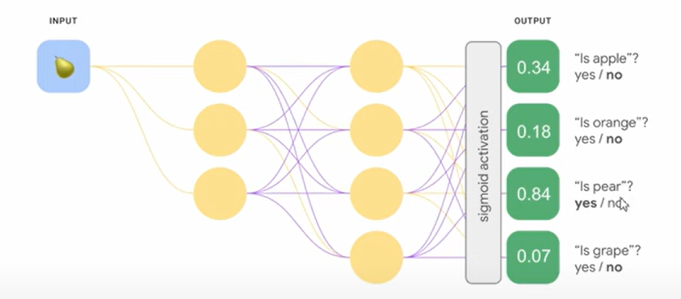

video 1 (speed distance ball aquisition)
video 2 (passes logic)
video 3 (intercepting ball logic and passes)

used to develop project. 
focus on different videos 

# locating different objects in frame and identify them

# iamge classification/image recognition (what is inside of an image) 
- usually have predefined list of classes 
- model has ability to produce one of those four classes
- prduces a number/index like 0 -4 to identify object

